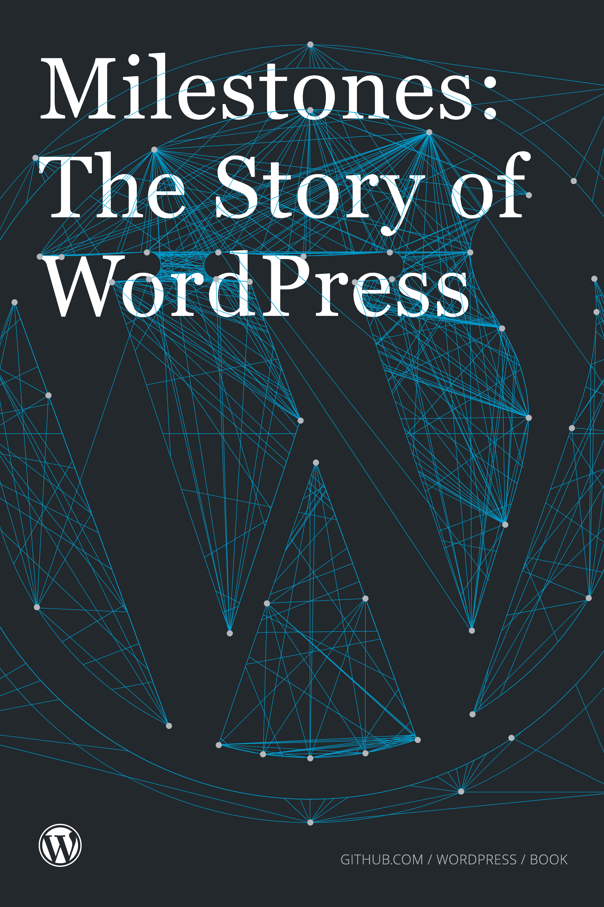

# Teil 1: Lernen und Verstehen {#teil-1}

# Vorwort
[WordPress](https://wordpress.org/) ist eine Software, die es Ihnen erlaubt Blogs und Webseiten aller Art zu verwalten. WordPress ist sehr mächtig und dennoch einfach zu handhaben. Es kann auf vielfältige Weise an die eigenen Bedürfnisse und Vorstellungen angepasst werden. Damit Sie Ihren Internet-Auftritt erfolgreich bewirtschaften können, erfahren Sie in dieser Einstiegs-Schulung die wichtigsten Begriffe, Konzepte und Arbeitsschritte.

## Über WordPress

WordPress entstand 2003. Matt Mullenweg nutzte für seinen persönlichen Blog die Software [b2/cafelog](http://cafelog.com/). Diese war nicht ganz uptodate, was Webstandards betraf. Der Entwickler reagierte nicht auf Anfragen und so suchte Matt via Forum Unterstützung aus b2/cafelog eine eigene Software zu forken [^fork]	

[^fork]: Als Fork bezeichnet man die aus einer Code-Kopie entstandenen Abwandlung einer Software. Dies ist bei unter der GPL (General Public License, siehe TODO: Verweis) lizenzierter Software legitim und gebräuchlich.

Auch von WordPress gibt es wiederum Forks, z. B. 

[ClassicPress](https://www.classicpress.net/), eine modifizierte, erweiterte Version von WordPress die ohne den neuen Block-Editor (Gutenberg) ausgeliefert wird. ClassicPress entstand 2019.

{alt: "Milestones: The Story of WordPress – Book Cover", align: right, width: 28%}Mehr zur Geschichte von WordPress kann man im "offiziellen" Buch [Milestones: The Story of WordPress](https://github.com/WordPress/book), welches auf https://github.com/wordpress/book gemeinschaftlich geschrieben wird, nachlesen.

> Genauso wie bei WordPress selbst steht es Ihnen frei, den Inhalt zu lesen, zu teilen, zu verteilen und zu modifizieren, wie Sie es wünschen.

[The Complete History of WordPress](https://www.namecheap.com/wordpress/history-of-wordpress/) von Namecheap (bis Ende 2018)

[Book about the history and development of WordPress](https://github.com/WordPress/book) ()

Mit Mike Little fand er einen Unterstützer und so entstand in wenigen

WordPress, welches am TODO: Datum veröffentlichten. Seither wurde WordPress ständig weiterentwickelt und ist heute das mit Abstand meistverbreitete [CMS](#cms).

TODO: aktuelle Nutzungstatistisk

TODO: Liste, der für jede neue Version upzudatenden Bilder und Statistiken

WordPress begann seinen Siegeszug als Blog-Software. Diese Herkunft merkt man WordPress immer noch an. Heute wird WordPress oft als CMS für "klassische" Webseiten verwendet oder dient als Basis für spezifische, individuelle Web-Anwendungen. So entstehen webbasierte Anwendungen für die Immobilienverwaltung, Reservationsseiten für Restaurants, oder Künstler- und Veranstaltungs-Websites.

Unter dem Menüpunkt [Showcase](https://wordpress.org/showcase/) von WordPress.org werden prominente Beispiele in verschiedenen Kategorien aufgeführt. Unternehmen wie [Facebook](https://newsroom.fb.com/), [Microsoft](http://blogs.microsoft.com/) oder auch [James Bond](http://www.007.com/) nutzen WordPress. Auch namhafte Unternehmen in der Schweiz setzen WordPress ein: 

TODO: Link zu GitHub Repo mit Showcases.

## Was ist ein Content Management System (CMS)?

Ein Content Management System erlaubt das Erstellen und Verwalten von Inhalt einer Website ohne spezifische Webdesign-Kenntnisse. Normalerweise sind die Gestaltungsmöglichkeiten eingeschränkt, da man nur freigegebene Bereiche bearbeiten kann. Wesentlicher Vorteil dabei ist, dass man sich somit automatisch mehr oder weniger sicher im Rahmen des "Corporate Designs" bzw. der Vorlage (Theme bei Wordpress) bewegt. Somit kommen alle Inhalte einheitlich daher.

## Was ist ein Blog?

Ein Blog ist eine spezielle Art von Webseite, die als eine Art Tagebuch geführt wird. Standardmässig werden bei einem Blog die Inhalte umgekehrt chronologisch angezeigt, also die neuesten Artikel zuoberst. Oft gibt es eine Übersichtsseite, in welcher die Beiträge nur angeteasert werden. Mit einem "Weiterlesen"-Link wird auf den kompletten Inhalt des Artikels geleitet.
Typisch für Blogs ist die Möglichkeit, Beiträge zu kommentieren.  Die Kommentare führen so manchmal zu leidenschaftlich geführten Debatten, die mindestens so lesenswert sind, wie der ursprüngliche Artikel. 

## Wordpress.com - Wordpress - Wordpress.org [^comvsorg]

Wenn wir in dieser Anleitung von WordPress sprechen, meinen wir damit die Software, die Sie auf Ihrem Web-Hosting installieren und welche Sie via Browser bedienen, anpassen und erweitern können.

WordPress gibt es unter der Webadresse [wordpress.com](https://wordpress.com/) ebenfalls als Service, der ohne eigene Installation genutzt werden kann. Bei diesem erhält man Zugriff auf die WordPress-Funktionen unter einer Web-Adresse, die wie `your-company.wordpress.com` aufgebaut ist. Eigene Anpassungen an den Themes sind hier nicht oder nur eingeschränkt (und kostenpflichtig) möglich. Ebenso war die Installation von Plugins lange Zeit ausgeschlossen. Inzwischen gibt es kostenpflichtige Varianten bei WordPress.COM, die auch das Hochladen von Plugins oder eigenen Themes ermöglichen.

TODO: Tabelle evtl. erweitern

{title="Unterschiede zwischen WordPress.ORG und WordPress.COM"}
| .org (Open Source Software) | .com (Kommerzieller Service) |
|--|--|
| Software zum Downloaden | Software zum Nutzen |
| gratis |(eingeschränkt) gratis |
| beliebig anpassbar | beschränkt anpassbar |

Die in der Tabelle erwähnten Unterschiede werden auf der deutschsprachigen Webseite [WordPress.com und WordPress.org](https://de.support.wordpress.com/com-vs-org/) detailliert erläutert.

TODO: COM VS ORG

Bei Ihrem selber gehosteten WordPress-basierten Internet-Auftritt steht es Ihnen frei jedes Detail nach Ihren Wünschen anzupassen.

## Wieso WordPress?

Es gibt unzählige Content Management Systeme[^oscms]. Warum sollen Sie also ausgerechnet WordPress verwenden?

Die WordPress Community selbst, verwaltet eine Liste mit Gründen für WordPress:

[https://github.com/WordPress/WP-Reasons/tree/master/de](https://github.com/WordPress/WP-Reasons/tree/master/de)

Zu den wichtigsten Argumenten gehören sicher:

### WordPress ist Open Source

Open Source bedeutet der Programmcode ist öffentlich. Statt einer Handvoll Entwickler einer einzigen Firma, die das Produkt weiterentwickeln oder nach Ihren eigenen Bedürfnissen anpassen kann (wenn sie will), gibt es Zehntausende von Entwicklern die individuelle Anpassungen vornehmen. Open Source bedeutet auch, dass man die Freiheit[^4freedoms] hat:

0. Das Programm zu jedem Zweck zu verwenden
1. Zu studieren, wie das Programm funktioniert und es nach Belieben anzupassen
2. Es weiterzugeben um jemandem zu helfen
3. Veränderte Versionen weiter zu geben

vergl. [https://de.wordpress.org/open-source-community/](https://de.wordpress.org/open-source-community/)

TODO: Bild Freiheiten (siehe Folien bzw. Link) einfügen.

### WordPress ist flexibel und erweiterbar

Nicht nur kann der Code generell angepasst werden, er ist auch so geschrieben, dass Erweiterungen oder Anpassungen problemlos integriert werden können. Die Erstellung einer vollständig individuellen Site erfordert von einem Entwickler daher bedeutend weniger Aufwand, als wenn er jede Funktion von Grund auf neu programmieren müsste.

Erweiterungen in Form von [Plugins](https://wordpress.org/plugins/) und [Themes](https://wordpress.org/themes/) sind für fast jeden denkbaren Anwendungsfall verfügbar. 

TODO: Stats

Aktuell gibt es alleine auf den wordpress.org Seiten x Themes und y Plugins. (Stand Mai 2019)

### WordPress hat eine mächtige Community

Die WordPress Gemeinschaft gilt als eine der freundlichsten und hilfsbereitesten Communities. Abertausende von WordPress Usern - Einzelpersonen und Unternehmen - welche dank WordPress Kosten sparen oder ein Geschäft starten konnten und dadurch von der WordPress-Community profitierten - geben gerne etwas an die Allgemeinheit zurück. So entstanden und entstehen unzählige Themes, Plugins, Dokumentationen, Übersetzungen und Antworten auf Anfragen in WordPress Foren[^wpforum]. Auch als Neuling wird man in der Community normalerweise wohlwollend und mit viel Hilfe aufgenommen. Probieren Sie es aus! Stellen Sie Fragen und staunen Sie, wie schnell, kompetent und hilfreich Sie Unterstützung erfahren werden. Und vergessen Sie nicht: Schon bald sind Sie selber in der Lage anderen weiterzuhelfen. Machen Sie das und Sie profitieren noch mehr von der lokalen und weltweiten Community und werden selbst zu einem Teil davon.

In der Schweiz (wie auch weltweit) treffen sich WordPress-Anwender regelmässig an Meetups und Wordcamps. Eine Liste der aktuellen Veranstaltungen werden direkt im WordPress Dashboard angezeigt.

TODO: Screenshot vom WordPress Dashboard, WP Events.

Über die WordCamps gibt die Seite

TODO: wordcamp Webseite

Auskunft.

Auf meiner Webseite [wp-schulung.ch](https://wp-schulung.ch) führe ich eine Liste der aktuellen Schweizer Termine.

### WordPress ist einfach zu nutzen

WordPress hatte von Anfang an den gewöhnlichen Anwender (zum Beispiel Blogger) im Fokus. Jene Person, die etwas zu sagen hat und dies möglichst einfach und bequem veröffentlichen möchte. Einer der Hauptziele von WordPress ist "democratising publishing", also jeder Person die Möglichkeit zu geben, ihre Meinung öffentlich zu vertreten. So entstand eine Software, die einfach zu bedienen ist und sich schnell weiterentwickelt.

### WordPress hat Zukunft

Zwar entstehen immer wieder Content Management Systeme, welche neue, innovative Konzepte zu Tage fördern, aber nur wenige erreichen eine relevante Marktdurchdringung. Laut [w3techs.com](w3techs.com) basieren über 25% aller Websites auf WordPress. Die nächstpopulären CMS folgen mit riesigem Abstand.[^cmsstats] WordPress bietet die Grundlage einiger der populärsten Websites und gewinnt seit mehr als 10 Jahren beständig an Popularität. Es ist äusserst unwahrscheinlich, dass es in naher Zukunft wesentlich an Bedeutung verliert. Matt Mullenweg meinte schon 2013 in einem Interview[^interview]

> WordPress ist grossartig, das sehe ich. Aber der Hauptgrund für die weitverbreitete Nutzung liegt in den 20'000 Plugins und 10'000 Themes. Hier entstand etwas Gemeinschaftliches. Es ist einfach zu kopieren, was WordPress kann. Kluge Ingenieure könnten das in einem Jahr schaffen. Aber diese Zehntausenden von Erweiterungen zu kopieren, wäre ein Lebenswerk. Selbst für eine grosse Firma wie Google wäre das schwer zu schaffen.

Es gibt also viele gute Gründe für WordPress. Trotzdem möchte ich etwas klarstellen: Wenn Sie Ihre Webseite durch eine Agentur erstellen lassen und später nur die Inhalte pflegen, nutzen Sie am Besten das CMS, welches Ihnen die Agentur empfiehlt.

Die meisten Webentwickler/Agenturen beherrschen nur ein System wirklich gut weil sie damit regelmässig arbeiten und Kundenprojekte erstellen. Wenn Sie auf WordPress beharren, obwohl Ihr bevorzugter Partner ein anderes System favorisiert, tun Sie weder sich noch dieser Firma einen Gefallen.

Da WordPress eine solch grosse Verbreitung hat, gibt es natürlich auch immer mehr Agenturen, die sich auf WordPress Webseiten spezialisiert haben.

Eine etwas willkürlich zusammengestellte und durch die Schweizer WordPress Community gepflegte Liste gibt es auf:

TODO: GitHub Link (oder WP-Schulung-Link)

Nachdem nun feststeht, dass WordPress eine gute Wahl ist, lernen Sie im nächsten Kapitel die Grundlagen von WordPress kennen.

[^comvsorg]: vergl.[WordPress.com und WordPress.org](https://de.support.wordpress.com/com-vs-org/)
[^oscms]: vergleiche:[OpenSourceCMS.com](http://www.opensourcecms.com/)
[^4freedoms]: vergl. [Matt Mullenweg: The Four Freedoms](http://ma.tt/2014/01/four-freedoms/)
[^wpforum]: z.B. [WordPress Deutschland Forum](http://forum.wpde.org/), [WordPress.org deutsch](https://de.forums.wordpress.org/forum/wordpress-deutschland) oder [WordPress Support Forum (englisch)](https://wordpress.org/support/)
[^interview]: [Mai 2013 Interview mit Matt Mullenweg on how open source is democratising the web](http://memeburn.com/2013/05/matt-mullenweg-on-how-open-source-is-democratising-the-web/)
[^cmsstats]: vergl. Google Trends [Schweiz](http://www.google.ch/trends/explore?hl=de&q=Joomla!,+Drupal,+Typo3,+WordPress,+Contao&geo=CH&cmpt=q&content=1#q=Joomla!%2C%20Drupal%2C%20Typo3%2C%20WordPress%2C%20Contao&geo=CH&cmpt=q&tz=Etc%2FGMT-1) / [weltweit](http://www.google.ch/trends/explore?hl=de&q=/m/02vtpl,+Joomla!,+Drupal,+Typo3,+WordPress&cmpt=q&content=1#q=%2Fm%2F02vtpl%2C%20Joomla!%2C%20Drupal%2C%20Typo3%2C%20WordPress&cmpt=q&tz=Etc%2FGMT-1), [built with CMS Usage Statistics](http://trends.builtwith.com/cms)